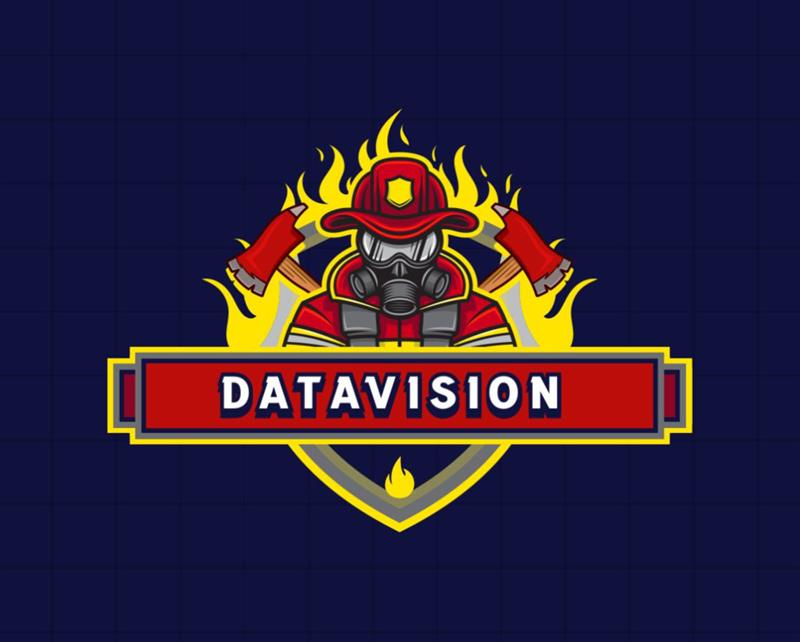

<h1 align="center">DataVision</h1>

  

 

## 📋 Description
Our website provides information about employees, fire trucks, and allows for reporting incidents and their need for assistance..

## 🚀 Languages 

 
  
  
  
  
  

## 🔧 Tools 
  
 
  
    
    <a href="https://www.microsoft.com/en-us/microsoft-365/powerpoint">
    <a href="https://www.microsoft.com/en-us/microsoft-365/excel">
     
    </a>
  
 
  

  
## 👨🏻‍💻 Team Members
| **Name** | **Role** | **Grade** |
| :---:   | :---: | :---: |
| Emanuela Mancheva| Designer | 🟨 9A |
| Gabriela Badalova | Scrum Trainer  | 🟥 9B |
| Mihail Conkov | Front-end developer  | 🟩 9V |
| Bojidar Stoyanov |  Back-end developer  | 🟦 9G |

